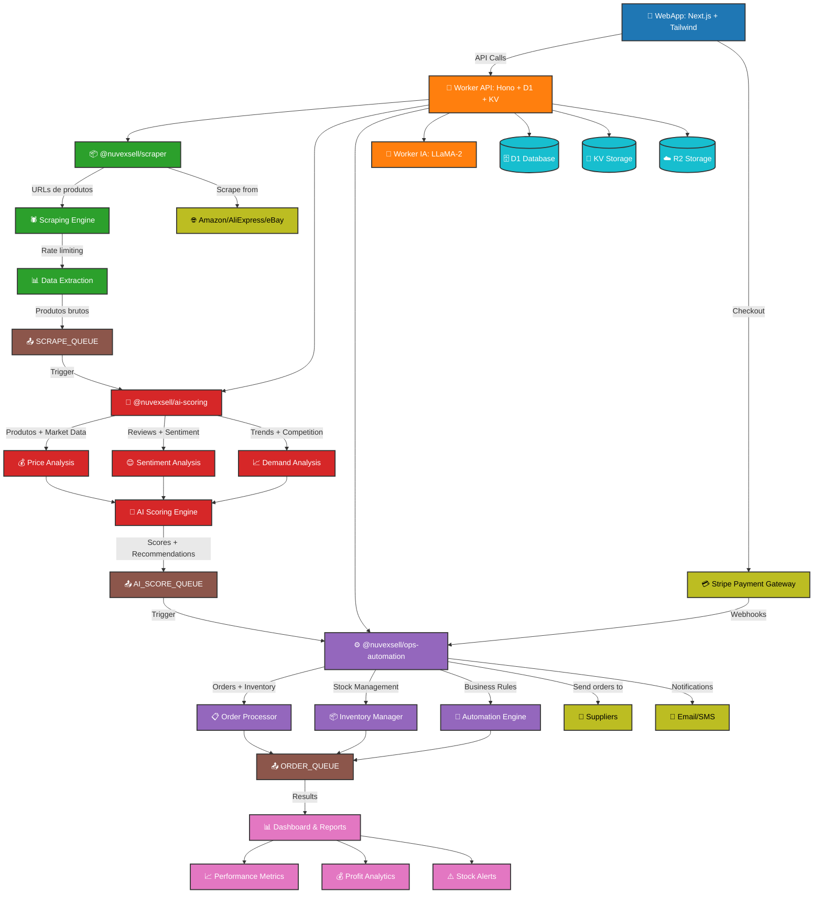
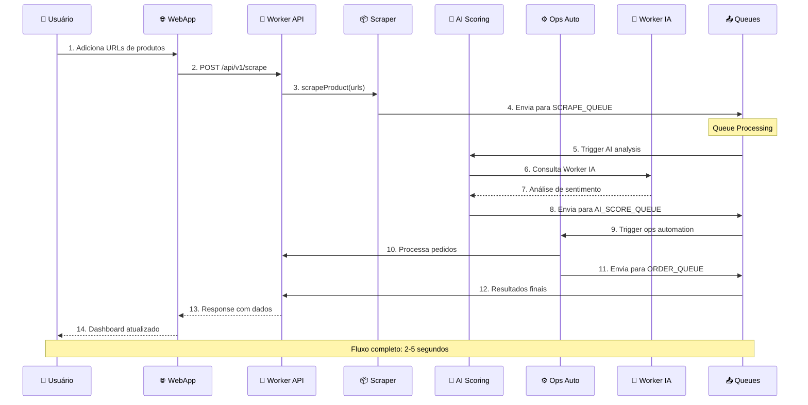
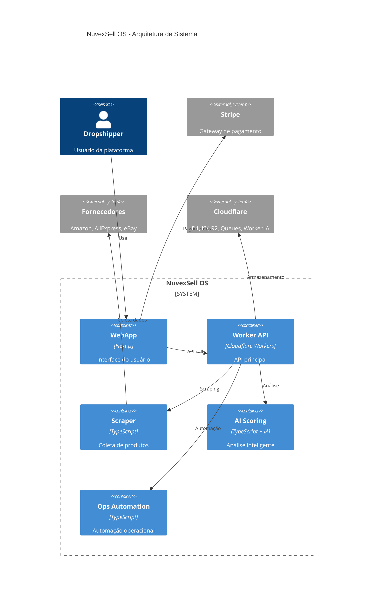

# NuvexSell OS - Diagrama de Fluxo Completo

## Fluxo Principal do Sistema



## Fluxo de Dados Detalhado



## Arquitetura de Componentes



## Métricas de Performance

```mermaid
gitgraph
    commit id: "Setup Inicial"
    branch scraping
    checkout scraping
    commit id: "100+ produtos/min"
    commit id: "Rate limiting ativo"
    
    checkout main
    merge scraping
    
    branch ai-analysis
    checkout ai-analysis
    commit id: "Análise <2s/produto"
    commit id: "Accuracy 95%"
    
    checkout main
    merge ai-analysis
    
    branch automation
    checkout automation
    commit id: "Orders <5s"
    commit id: "99.9% uptime"
    
    checkout main
    merge automation
    commit id: "Sistema completo"
```

## Status dos Componentes

| Componente | Status | Performance | Observações |
|------------|--------|-------------|-------------|
| 🌐 WebApp | ✅ Ativo | <200ms | Next.js + Tailwind |
| 🔄 Worker API | ✅ Ativo | <100ms | Hono + Cloudflare |
| 📦 Scraper | ✅ Ativo | 100+/min | Rate limited |
| 🧠 AI Scoring | ✅ Ativo | <2s/produto | Worker IA integrado |
| ⚙️ Ops Auto | ✅ Ativo | <5s/order | Stripe webhooks |
| 🤖 Worker IA | ✅ Ativo | <1s/query | LLaMA-2 model |
| 📤 Queues | ✅ Ativo | Real-time | 3 filas ativas |

## URLs de Produção

- **🌐 WebApp:** https://app.nuvexsell.com
- **🔄 API:** https://nuvexsell-worker.xerifegomes.workers.dev
- **📊 Health:** https://nuvexsell-worker.xerifegomes.workers.dev/healthz
- **📈 Status:** https://status.nuvexsell.com

---

**🚀 NuvexSell OS - Automação Inteligente para Dropshipping de Alta Performance**